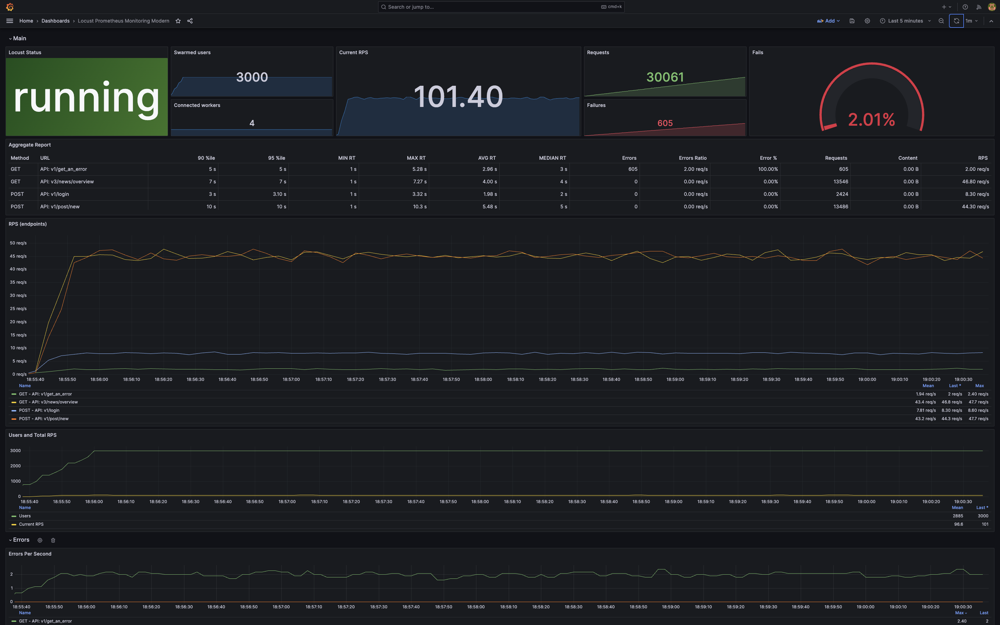

# Locust Prometheus Exporter

[](https://hub.docker.com/r/vokash3/locust_exporter/tags)

Inspired by [ContainerSolutions/locust_exporter](https://github.com/ContainerSolutions/locust_exporter) and [mbolek/locust_exporter](https://github.com/mbolek/locust_exporter)

*This is a [Locust](https://github.com/locustio/locust) exporter for [Prometheus](https://github.com/prometheus/prometheus) made on Python.*

[](https://grafana.com/grafana/dashboards/20462-locust-prometheus-monitoring-modern/)

## Requirements
For the best experience of using this exporter you need to be installed:
1. [Prometheus](https://prometheus.io/download/)
2. [Grafana](https://grafana.com/grafana/download?pg=get&plcmt=selfmanaged-box1-cta1)
3. [Python 3.10-3.12](https://www.python.org/downloads/)
4. *(Optional)* [Docker](https://docs.docker.com/desktop/)

## Quick Start

1. Start Locust (you can use legacy and modern UI, but I prefer Legacy)
2. Modify ``prometheus.yml`` and start Prometheus:
    ```
   - job_name: 'locust'

    scrape_interval: 2s
    scrape_timeout: 2s
    static_configs:
      - targets: ['<exporter_host>:<exporter_port>']
   ```
2. Configure ``config.json`` in the root of this project as you need:
    - port – on this port export will start (this port also should be used in ``prometheus.yml``)
    - host – where Locust is up
3. Run
    ```bash
    python3 LocustExporter.py --config config.json
    ```
4. Use this [Grafana Dashboard](https://grafana.com/grafana/dashboards/20462-locust-prometheus-monitoring-modern/) to watch your Locust.

## (Alternative) Quick Start With Docker
Complete the first two steps from the previous section (Quick Start) and then use this:
[Docker Hub](https://hub.docker.com/r/vokash3/locust_exporter) or use ``Dockerfile`` in the root of this project.


