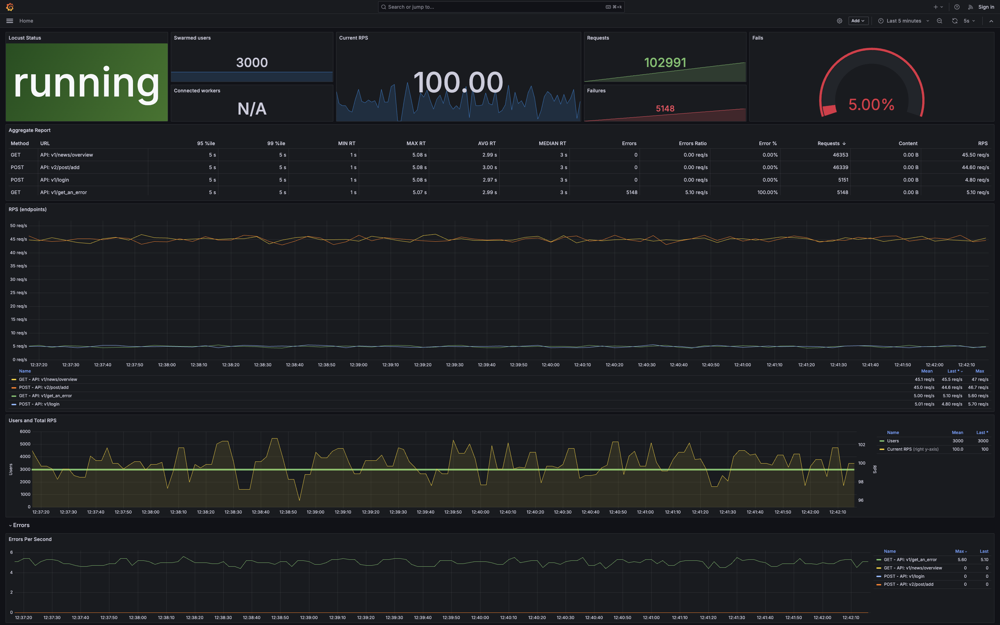

# Locust Prometheus Exporter

_Compatible with Locust 2.12.X - 2.42.X_

[](https://hub.docker.com/r/vokash3/locust_exporter/tags)

Inspired by [ContainerSolutions/locust_exporter](https://github.com/ContainerSolutions/locust_exporter)
and [mbolek/locust_exporter](https://github.com/mbolek/locust_exporter)

*This is a [Locust](https://github.com/locustio/locust) exporter
for [Prometheus](https://github.com/prometheus/prometheus) made on Python.*

[](https://grafana.com/grafana/dashboards/20462-locust-prometheus-monitoring-modern/)

## Requirements

For the best experience of using this exporter you need to be installed:

1. [Prometheus](https://prometheus.io/download/)
2. [Grafana](https://grafana.com/grafana/download?pg=get&plcmt=selfmanaged-box1-cta1)
3. [Python 3.10-3.12](https://www.python.org/downloads/)
4. *(Optional)* [Docker](https://docs.docker.com/desktop/)

## Quick Start

1. Start Locust (you can use legacy and modern UI, but I prefer Legacy)
2. Modify ``prometheus.yml`` and start Prometheus:
    ```
   - job_name: 'locust'

    scrape_interval: 2s
    scrape_timeout: 2s
    static_configs:
      - targets: ['<exporter_host>:<exporter_port>']
   ```
2. Configure ``config.json`` in the root of this project as you need:
    - port – on this port export will start (this port also should be used in ``prometheus.yml``)
    - host – where Locust is up
3. Run
    ```bash
    python3 LocustExporter.py --config config.json
    ```
4. Use this [Grafana Dashboard](https://grafana.com/grafana/dashboards/20462-locust-prometheus-monitoring-modern/) to
   watch your Locust.

## (Alternative) Quick Start With Docker

Complete the first two steps from the previous section (Quick Start) and then use this:
[Docker Hub](https://hub.docker.com/r/vokash3/locust_exporter) or use ``Dockerfile`` in the root of this project.

## (Alternative) An Extremely Fast Solution [Docker Compose]

If you don't want to worry about anything you really should try out this way!

_First of all, you need docker installed in your system!_

When all is ready follow this steps:

- clone or download this project
- go to *docker* dir of the project
   ```bash
  cd docker
  ```
- Using your editor (vim, nano ...) change **LOCUST_HOST** in *locust_exporter* block of **docker-compose.yml** to desired one

    - if your Locust is up on localhost you don't need to edit this file (pass edit step)
- run docker compose up (first time)
   ```bash
  docker compose up -d
  ```
  OR (if U need to rebuild existing containers with new configs)
   ```bash
  docker compose up -d --remove-orphans
  ```
- ENJOY IT ;-)

### Used ports

- 3000/tcp - grafana
- 9090/tcp - prometheus
- 9191/tcp - locust_exporter

*In order to change them, edit configs!*


